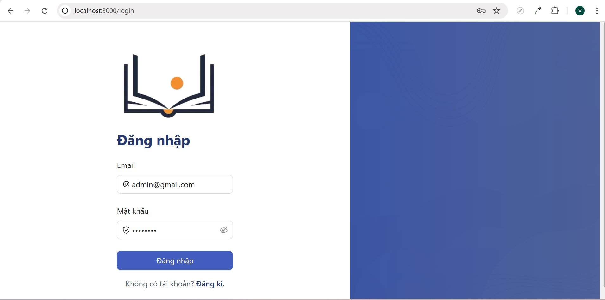
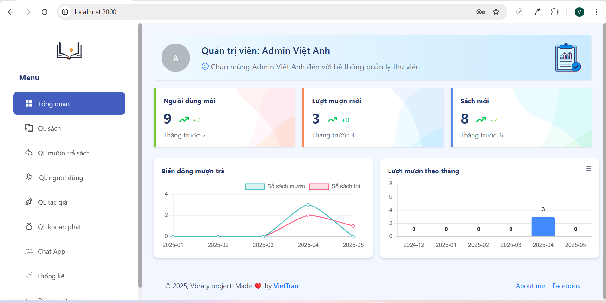
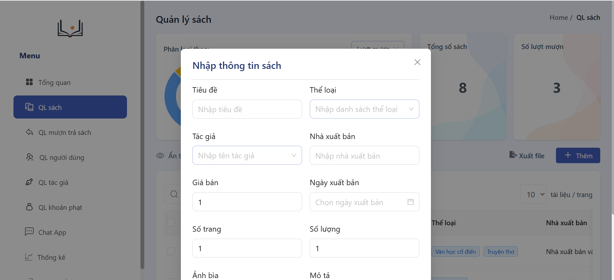
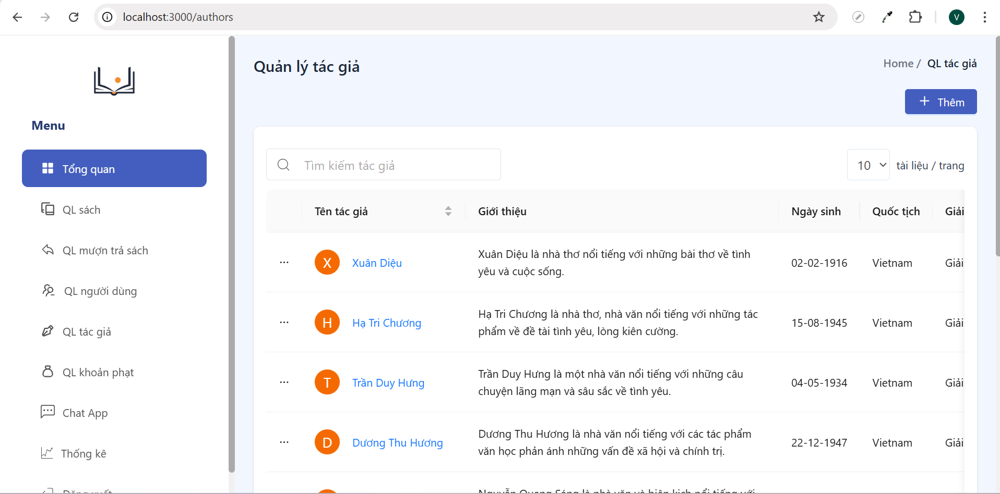
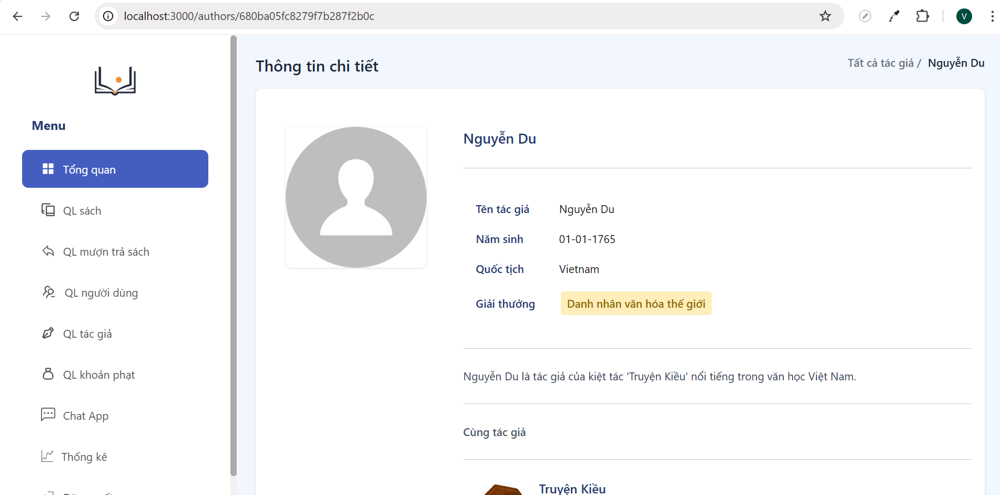
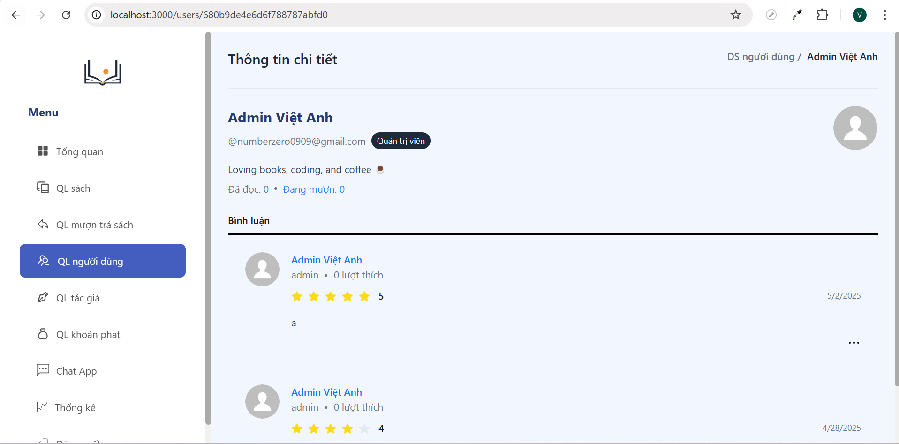
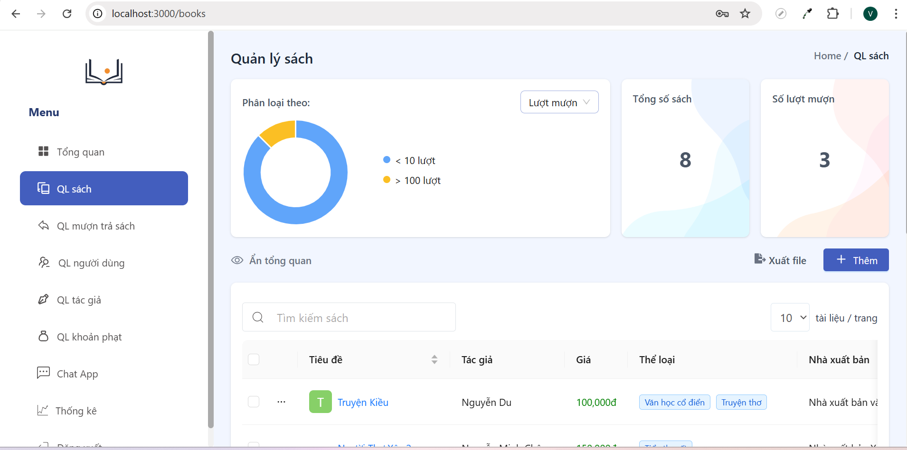

## 📌Hướng Dẫn Cài Đặt và Chạy Dự Án

Để clone dự án từ GitHub về máy tính của bạn, làm theo các bước sau:

1. Mở terminal trong Visual Studio Code
   ```bash
   git clone https://github.com/helloVietTran/library-management-fe
2. Di chuyển tới thư mục dự án
   ```bash
   cd library-management-fe
3. Kiểm tra đã cài bun chưa, nếu đã cải rồi bỏ qua bước 4
   ```bash
   bun --version
4. Nếu không hiện version. Vui lòng cài Bun 🚀
   
      💻 **Nếu bạn sử dụng macOS, Linux, hoặc WSL**

     Dán dòng lệnh này vào terminal (macOS, Linux, hoặc WSL):
     
     ```bash
     curl -fsSL https://bun.sh/install | bash
     ```
     💻 **Nếu là windows, dán dòng lệnh vào cmd:**
    ```bash
     powershell -c "irm bun.sh/install.ps1|iex"
     ```
     Hoặc cài thông qua npm:
     ```bash
     npm install -g bun
5. Sau khi cài thành công bun, chạy lệnh sau trong terminal visual studio code ở thư mục dự án 
     ```bash
     bun install
6. Để chạy dự án, chạy tiếp lệnh sau
     ```bash
     bun run dev
     ```
### 🎉 Chúc mừng! Bạn đã chạy dự án thành công 

# 📚 Về dự án - Library management website - Vbrary

Một hệ thống quản lý thư viện giúp quản lý sách, độc giả, mượn trả sách. 

## 🚀 Tính năng chính

- Quản lý sách (thêm, sửa, xoá, tìm kiếm)
- Quản lý người dùng (đăng ký, cập nhật thông tin, xoá)
- Quản lý mượn/trả sách
- Hỗ trợ người dùng gửi email khi người dùng quá hạn trả sách
- Phân quyền theo vai trò
- Giao diện người dùng trực quan, responsive
- Cung cấp một số thống kê dưới dạng số liệu, bảng biểu về tình hình thư viện: biến động mượn trả, thống kê sách theo lượt mượn
- Cung cấp 1 Chat App đơn giản
- Xác thực bằng JWT, refresh token
- Hỗ trợ xuất file pdf hoặc xlsx

## 🛠️ Công nghệ nổi bật
     Next.js, TypeScript, Tailwind CSS, Zustand, Ant Design, Framer motion, React Query

## 🎬 Demo 

<table>
  <tr>
    <td></td>
    <td></td>
  </tr>
  <tr>
    <td></td>
    <td></td>
  </tr>
  <tr>
    <td></td>
    <td></td>
  </tr>
  <tr>
    <td></td>
    <td></td>
  </tr>
</table>
    
## 👤 Thông tin tài khoản test 
📌 Admin: tài khoản: admin@gmail.com | mật khẩu: admin123
## 📌 Hướng phát triển tương lai
- Cung cấp tìm kiếm sách trên nhiều tiêu chí
- Đề xuất các sách liên quan
- Cung cấp tính năng thống kê trên nhiều tiêu chí
- Phát triển thêm giao diện mượn sách

## 📄 License
- Hoàn toàn miễn phí


   
    
   
   
